# Hi, I'm Satyajit 👋

<div align="center">
  
  [](https://git.io/typing-svg)
  
  <p align="center">
    
    
  </p>

</div>

---

## 👨‍💻 About Me

I'm a **Computer Science student** passionate about building **scalable full-stack applications**, **AI-powered systems**, and **cloud-native solutions**. I enjoy solving complex problems and turning ideas into production-ready software.

```javascript
const satyajit = {
  location: "Odisha, India 🇮🇳",
  currentFocus: "Building AI-powered, scalable full-stack systems",
  education: "Computer Science Student",
  expertise: [
    "Full-Stack Development (MERN)",
    "Generative AI & Agentic AI",
    "Backend Architecture & System Design",
    "Data Structures & Algorithms",
    "Cloud & DevOps Engineering"
  ],
  learning: ["AWS", "Docker", "Kubernetes", "CI/CD", "Microservices"],
  goals: [
    "Secure a top tech internship",
    "Build production-grade AI systems",
    "Become a strong Cloud + AI Engineer"
  ],
  funFact: "I debug distributed systems with logs, metrics, and coffee ☕"
};
```

<table>
  <tr>
    <td>📍</td>
    <td><strong>Location:</strong> Odisha, India</td>
  </tr>
  <tr>
    <td>💼</td>
    <td><strong>Focus:</strong> Full-Stack Development, Generative AI, Agentic AI, DevOps</td>
  </tr>
  <tr>
    <td>🧠</td>
    <td><strong>Foundation:</strong> Strong in Data Structures & Algorithms (500+ problems solved)</td>
  </tr>
  <tr>
    <td>☁️</td>
    <td><strong>Experience:</strong> Cloud, CI/CD, and containerized systems</td>
  </tr>
  <tr>
    <td>🎯</td>
    <td><strong>Goal:</strong> Secure a top tech internship and grow as a Cloud + AI Engineer</td>
  </tr>
</table>

---

## 🛠️ Tech Arsenal

### **Programming Languages**

<p align="left">
  
  
  
  
  
</p>

### **Frontend Development**

<p align="left">
  
  
  
</p>

### **Backend Development**

<p align="left">
  
  
  
  
</p>

### **Databases**

<p align="left">
  
  
</p>

### **Generative AI & Agentic AI**

<p align="left">
  
  
  
  
</p>

**AI Capabilities:**
- 🧠 **LLM-powered applications** - Building intelligent systems with GPT, Claude, and open-source models
- 🤖 **Agentic workflows** - Implementing tool calling, memory systems, and reasoning loops
- 📚 **Retrieval-Augmented Generation (RAG)** - Context-aware AI with vector databases
- ✍️ **Prompt engineering** - Optimizing AI outputs through strategic prompting
- 🔗 **AI-driven automation systems** - Intelligent workflows and decision-making pipelines

### **Cloud, DevOps & CI/CD**

<p align="left">
  
  
  
  
  
</p>

**DevOps Expertise:**
- ☁️ **AWS Services** - IAM, EC2, S3, CodePipeline (fundamentals)
- 🐳 **Docker** - Containerization and deployment
- ⚙️ **Kubernetes** - Container orchestration basics
- 🔄 **CI/CD Pipelines** - GitHub Actions, AWS CodePipeline
- 🚀 **Deployment & Automation** - Streamlined workflows and infrastructure

---

## 🔄 CI/CD & Deployment Pipeline

### **Pipeline Architecture**

```mermaid
graph LR
    A[💻 Code Push] --> B[🔍 GitHub Actions]
    B --> C[🧪 Build & Test]
    C --> D{✅ Tests Pass?}
    D -->|Yes| E[🐳 Build Docker Image]
    D -->|No| F[❌ Notify Developer]
    E --> G[📦 Push to Registry]
    G --> H[🚀 Deploy to AWS]
    H --> I[💚 Health Checks]
    I --> J{🔍 Healthy?}
    J -->|Yes| K[✨ Production Live]
    J -->|No| L[↩️ Rollback]
```



### **CI/CD Capabilities**

- 🔄 GitHub Actions workflow automation
- 🐳 Docker containerization & deployment
- ☁️ AWS pipeline integration (EC2, S3)
- ✅ Automated testing & build processes

---

## 🏆 Achievements & Certifications

<div align="center">

| 🏅 Achievement | 📊 Details |
|----------------|-----------|
| **LeetCode Contest** | Global Rank **1421** among **20,000+** participants |
| **DSA Master** | Solved **500+ problems** on LeetCode & GeeksforGeeks |
| **HackerRank** | Multiple **Skill Certifications** earned |
| **Certifications** | Full-Stack Development, DSA, Generative AI & Agentic AI |

</div>

---

## 💡 Problem Solving Journey

```text
📈 Coding Platforms
━━━━━━━━━━━━━━━━━━━━━━━━━━━━━━━━━━━━━━━━━━━━━━━━━━━━

🔥 Primary Languages   : Java, Python
📝 LeetCode            : 500+ Problems Solved
📝 GeeksforGeeks       : Active Problem Solver
🎯 Current Focus       : Advanced DSA Patterns
⭐ Core Areas          : Arrays, Trees, Graphs, Dynamic Programming

💪 Problem Categories Mastered:
   ├─ Arrays & Strings        ████████████████░░  85%
   ├─ Trees & Graphs          ███████████████░░░  80%
   ├─ Dynamic Programming     ██████████████░░░░  75%
   ├─ Recursion & Backtracking ████████████░░░░░  65%
   └─ System Design Basics    ██████████░░░░░░░  55%
```

<div align="center">

[](https://leetcode.com/u/SATYAJIT-SAHOO/)
[](https://www.geeksforgeeks.org/user/satyajitsaf4tx/)
[](https://hackerrank.com)

</div>

---

## 📊 GitHub Analytics

<div align="center">
  
  
</div>

<div align="center">
  
</div>

<div align="center">
  
</div>

---

## 🚀 Current Learning

<table>
  <tr>
    <td>☁️</td>
    <td><strong>Advanced AWS & DevOps practices</strong> - Diving deeper into cloud architecture</td>
  </tr>
  <tr>
    <td>🔄</td>
    <td><strong>CI/CD pipelines and cloud deployments</strong> - Mastering automation workflows</td>
  </tr>
  <tr>
    <td>🏗️</td>
    <td><strong>Scalable AI system design</strong> - Building production-grade AI applications</td>
  </tr>
  <tr>
    <td>📊</td>
    <td><strong>Microservices architecture</strong> - Designing distributed systems</td>
  </tr>
</table>

---

## 🎯 2026 Goals

<div align="center">


</div>

---

## 🤝 Connect With Me

<div align="center">

I'm always open to **internships**, **collaboration**, and **impactful engineering work**.

<p align="center">
  <a href="https://www.linkedin.com/in/satyajit-sahoo-b16795315">
    
  </a>
  <a href="https://github.com/Satyajit-69">
    
  </a>
  <a href="https://leetcode.com/u/SATYAJIT-SAHOO/">
    
  </a>
  <a href="https://www.geeksforgeeks.org/user/satyajitsaf4tx/">
    
  </a>
  <a href="mailto:satyajitsahoo28252@gmail.com">
    
  </a>
</p>

### 📧 **Email:** satyajitsahoo28252@gmail.com

</div>

---

<div align="center">

### ⭐ If you find my work interesting, feel free to star my repositories ⭐


**Made with ❤️ by Satyajit**

*"Building the future, one commit at a time"*

</div>
